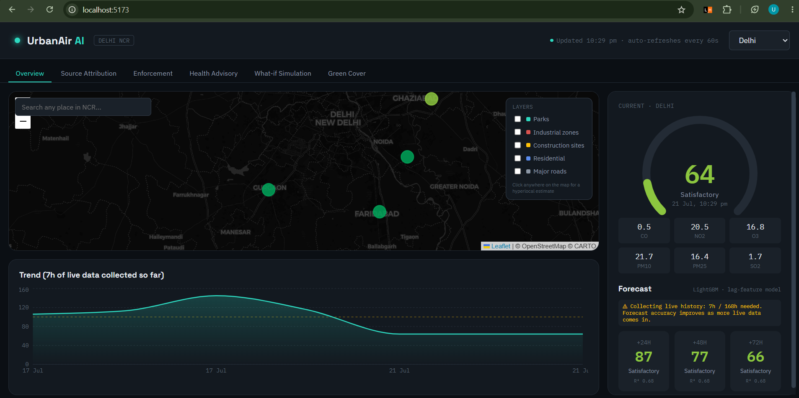
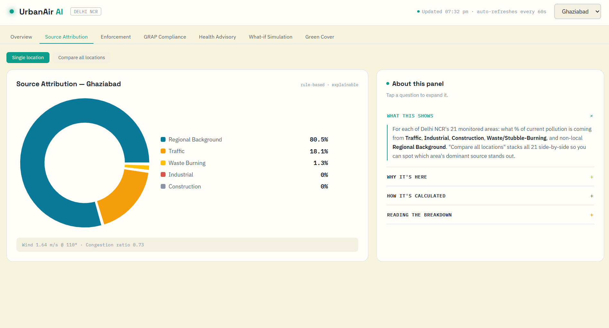
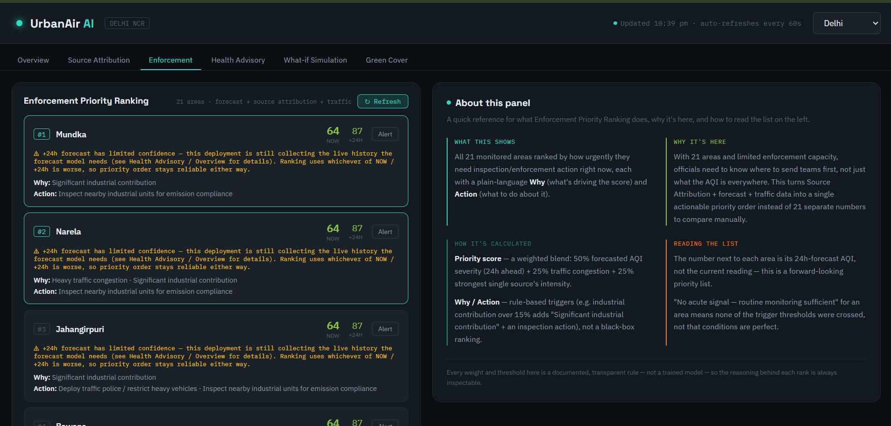
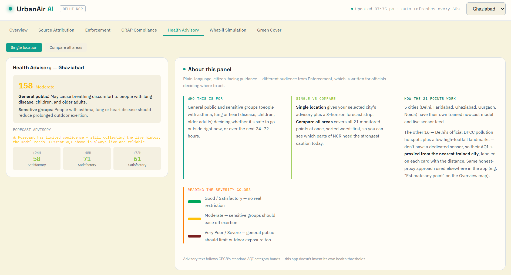
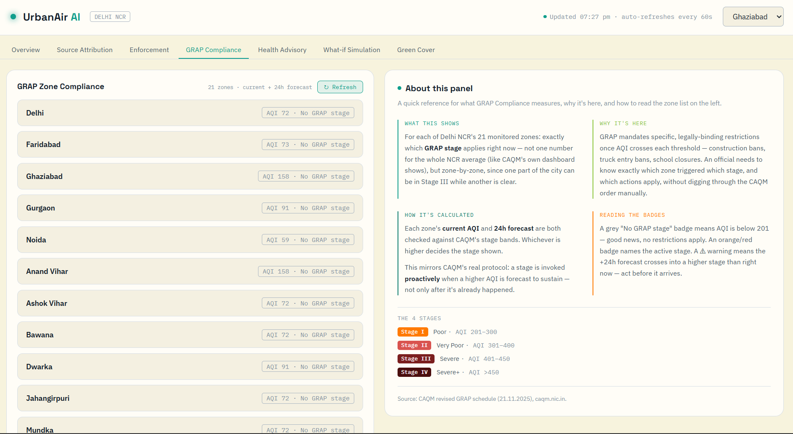
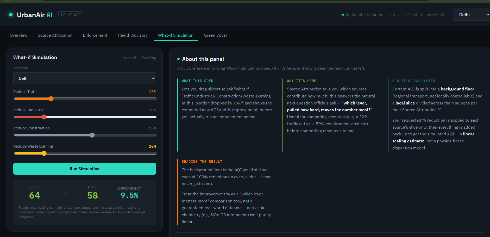
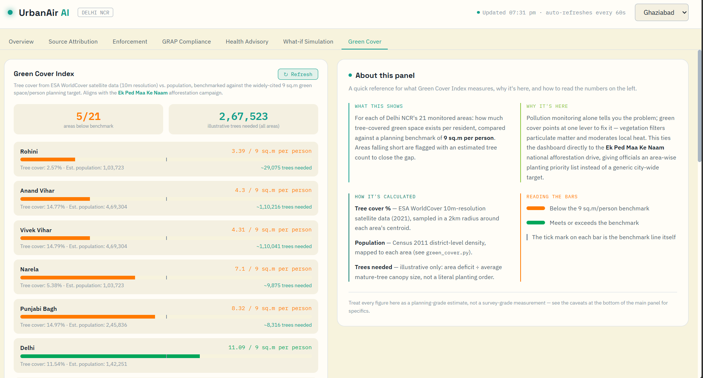

# UrbanAir AI — Full-Stack Prototype

Delhi NCR air quality monitoring + forecasting + source-attribution
dashboard. Covers all seven core features from the Feature Freeze doc —
Live AQI Dashboard, Source Attribution, Enforcement Intelligence, Health
Advisory, GRAP Compliance, What-if Simulation, and Green Cover Index.
Only the **Gemini Chat Assistant** remains as future work.

## Structure

- urbanair_backend/ ← FastAPI (models + rule engines + data API)
- urbanair_frontend/ ← React + Leaflet + Recharts dashboard


## Run it (full setup, start to end)

**Prerequisites:** Python 3.10+ and Node.js 18+. API keys are already
included in `.env` (aqi_model/) and `.env` (urbanair_backend/) — nothing
to sign up for, just install and run.

You'll end up with **3 terminals running at once** — collectors, backend,
frontend. Start them in this order.

### 1. Unzip and go to the project root
```bash
unzip urbanair_full_stack.zip
cd urbanair_full_stack
```

### 2. Terminal 1 — live-data collectors (`aqi_model/`)
```bash
cd aqi_model
python -m venv venv
source venv/bin/activate        # Windows: venv\Scripts\activate
pip install -r requirements.txt

python run_all.py
```
`.env` with the API keys is already in this folder — no setup needed
there. Leave this running. `run_all.py` starts all 4 collectors (air
pollution, traffic, weather, WAQI ground AQI) on loop, **and** syncs the
logs it produces into `urbanair_backend/` every 5 minutes automatically —
this single command replaces running each collector separately and the
old `sync_logs.ps1`. Give it a minute or two after first starting so each
collector has logged at least one row before you open the dashboard —
the backend returns a 503 for a city until its first live reading lands.

### 3. Terminal 2 — backend (`urbanair_backend/`)
```bash
cd urbanair_full_stack
cd urbanair_backend
python -m venv venv
source venv/bin/activate        # Windows: venv\Scripts\activate
pip install -r requirements.txt

python -m uvicorn app.main:app --reload --port 8000
```
`.env` (email + Groq arbitration keys) is already included here too —
nothing else to configure.

### 4. Terminal 3 — frontend (`urbanair_frontend/`)
```bash
cd urbanair_full_stack
cd urbanair_frontend
npm install
npm run dev
```

Open **http://localhost:5173** — the Vite dev server proxies `/api/*` to
the FastAPI backend on port 8000 automatically (see `vite.config.js`).

### Day-to-day after first setup
Only Terminal 1 (`python run_all.py`, from inside `aqi_model/` with its
venv active) needs to be kept running for fresh data — leave it up
whenever you want the dashboard showing live numbers. Backend and
frontend can be started/stopped independently of it.

## What it does

Seven tabs, all working at the **21-zone level** (5 cities + 13 official
CAQM hotspots + 3 landmarks):

- **Overview** — Map (Leaflet, CARTO basemap) with all 21 monitored
  points colored by live AQI severity, toggleable layers (parks/
  industrial/construction/residential/roads), instrument-style AQI
  gauge, pollutant readings, 24/48/72h forecast panel, 7-day trend
  chart. Search any location or click anywhere on the map for a
  hyperlocal estimate — not limited to the 21 pre-registered points.
- **Source Attribution** — donut chart breaking down Traffic /
  Industrial / Construction / Waste-Burning / Regional Background %
  for the selected point, using live traffic congestion + wind
  direction/speed + proximity to industrial/construction zones + a
  seasonal stubble-burning heuristic. Includes a compare-all view
  stacking all 21 points side by side.
- **Enforcement** — ranked priority list across all 21 monitored
  points, each with plain-language reasons and recommended actions,
  driven by forecast severity + source mix + traffic congestion. Each
  row can generate and send an Official Report + Hinglish Public
  Advisory alert as a real email.
- **Health Advisory** — current + forecast CPCB-band health advisory
  text for general public and sensitive groups.
- **GRAP Compliance** — AQI (live and forecast) is mapped directly to
  the real CAQM Graded Response Action Plan stage (I–IV) and its actual
  mandated actions — halt construction, ban non-essential diesel
  trucks, odd-even rationing, etc. This isn't an invented severity
  scale; it's the one Delhi NCR already operates under, so officials
  don't have to learn a parallel system on top of what they already
  use.
- **What-if Simulation** — sliders to simulate reducing Traffic/
  Industrial/Construction/Waste-Burning by X%, shows before/after AQI
  and % improvement.
- **Green Cover Index** — satellite tree cover vs. estimated population
  for each of the 21 areas, benchmarked against the 9 sq.m/person
  planning reference, tied to the *Ek Ped Maa Ke Naam* national
  afforestation campaign.

## Application Screenshots

### Dashboard


### Source Attribution


### Enforcement Intelligence


### Health Advisory


### GRAP Compliance


### What-if Simulation


### Green Cover Index


## Design direction

Built as a control-room / instrumentation interface (not a marketing
page) since the actual audience is DPCC/MCD officials monitoring live
conditions: a clean, high-contrast **light base** so severity colors
still read clearly at a glance, monospace (IBM Plex Mono) for all
numeric readouts to feel measured, Space Grotesk for headers. The AQI
severity palette carries real meaning (CPCB bands), kept separate from
the app's own accent color (teal) so users never confuse "the brand
color" with "a pollution reading."

## Model performance

Two models, two very different bars:

- **Nowcast** (pollutants → AQI): R² 0.9999, 99.8% category accuracy.
  AQI is a formula of pollutant sub-indices, so the model is learning
  that formula — near-perfect R² is expected here, not a data leak.
- **Forecast** (24h/48h/72h ahead): R² ~0.68 across all three horizons,
  trained only on pre-event information (lagged AQI/PM readings,
  rolling stats correctly shifted so "now" never leaks into its own
  window). Beats a naive "tomorrow = today" baseline by ~27% at every
  horizon. This is the number that reflects the model actually learning
  something rather than recomputing a known formula — lead with this
  one over the 0.9999 if asked which is harder.

## WAQI-vs-model arbitration (Groq)

When the live ground-station reading (WAQI) and the model's nowcast
disagree by more than 15%, a Groq LLM call weighs both against context —
recent trend, pollutant levels, each source's known error pattern —
similar to how an analyst would cross-check two instruments. This is a
**plausibility check, not verified ground truth** (an LLM can't measure
air). When the two sources already agree, no LLM call happens — WAQI is
used directly. If the Groq key is missing or the call fails, it falls
back to WAQI rather than blocking the response. See `groq_arbiter.py`.

## Geospatial data QA

The geospatial layers (parks/residential/industrial/roads) were
originally broken — an Overpass query scoped wrong meant
`parks.geojson` and `residential.geojson` were actually **Rome,
Italy**, and `industrial.geojson` / `roads.geojson` were empty. All five
were re-extracted directly from the regional OSM PBF, clipped to the
exact bounding box of the pollutant rasters (283,558 roads, 12,641
major roads, 4,777 parks, 4,166 residential zones, 635 industrial
zones). See `extract_osm_layers.py`.

## API endpoints (backend)

| Endpoint | Purpose |
|---|---|
| `GET /api/cities` | List of 5 cities + coordinates |
| `GET /api/current/{city}` | Latest known AQI + pollutants |
| `POST /api/nowcast` | AQI from manually entered pollutant readings |
| `GET /api/forecast/{city}` | 24/48/72h forecast (optional `reference_time` for demo/backtest mode) |
| `GET /api/historical/{city}?hours=168` | Time series for the trend chart |
| `GET /api/geojson/{layer}` | `parks` \| `residential` \| `industrial` \| `construction` \| `roads` |
| `GET /api/source-attribution` | Traffic/Industrial/Construction/Waste-Burning/Background % for all 21 points, for the compare view |
| `GET /api/source-attribution/{point}` | Same, for one city or hotspot |
| `GET /api/enforcement` | Ranked priority list with reasons + recommended actions |
| `GET /api/health-advisory/{city}` | Current + forecast health advisory (CPCB-band text) |
| `GET /api/grap-compliance` | GRAP stage (current + 24h forecast) for all 21 zones |
| `POST /api/whatif` | Simulate reducing sources by X%, get before/after AQI |
| `GET /api/green-cover` | Green Cover Index for all 21 areas |
| `GET /api/green-cover/{point}` | Same, for one area |
| `GET /api/search-location?query=...` | Free-text geocoding (Nominatim), NCR-bounded |
| `GET /api/estimate?lat=..&lon=..` | Hyperlocal estimate for ANY point (not just the 21 pre-registered ones) |
| `GET /api/alerts/officials/{point}` | Generates structured official-report analysis text |
| `GET /api/alerts/public/{point}` | Generates short Hinglish public advisory text |
| `POST /api/alerts/send` | Sends either as an email (needs SMTP configured) |
| `GET /api/alerts/status` | Whether SMTP is configured |

## Keeping traffic/weather/AQI data fresh

`source_attribution.py`, `main.py`, and `live_history.py` all read their
live CSVs (`traffic_log.csv`, `weather_current_log.csv`,
`live_pollutants_log.csv`, `live_ground_aqi_log.csv`) **from inside
`urbanair_backend/`**, but the collectors in `aqi_model/` write to
`aqi_model/` instead. `python run_all.py` (see setup above) handles
copying the latest files across automatically every 5 minutes — as long
as it's running, you don't need to think about this. If you ever see
stale numbers, check that Terminal 1 (`run_all.py`) is still alive.

No backend restart is needed either way — it re-reads the CSVs on every
request.

## Important note on Source Attribution / Enforcement

These are **transparent rule-based engines**, not trained ML classifiers
— there's no labeled "ground truth pollution source" dataset to train
against (this is true of real-world source apportionment too; CPCB/SAFAR
use similar rule + dispersion-model hybrids, not pure ML). Every weight
in `source_attribution.py` is a documented assumption based on known
atmospheric behavior (wind carries industrial/agricultural smoke, calm
wind concentrates pollutants, stubble burning is seasonal Oct–Nov), not a
fitted parameter. This is honest to present in your report/demo as
"explainable rule-based reasoning" — arguably a stronger pitch for a
government-facing tool than an opaque model would be.

## Area-wise granularity

Expanded from 7 points to Delhi's **13 officially designated pollution
hotspots** (Anand Vihar, Ashok Vihar, Bawana, Dwarka, Jahangirpuri,
Mundka, Narela, Okhla, Punjabi Bagh, R.K. Puram, Rohini, Vivek Vihar,
Wazirpur — per Dept. of Environment, GNCTD, 2018) plus 3 iconic
landmarks (Chandni Chowk, Red Fort, Connaught Place), for 21 points
total. Source Attribution, Enforcement, GRAP Compliance, and What-if all
work at this area level, not just city level. Coordinates are
approximate locality centroids — cross-check against CPCB's official
CAAQMS station list if you need monitoring-station-grade precision
(link is in `source_attribution.py`'s comments).

## Email alerts

Already configured in the included `.env` — no setup needed. Restart the
backend to pick it up. Without this, alert *preview* still works fully —
only actual sending needs the SMTP credentials. `GET /api/alerts/status`
tells you if it's configured.

**This is a demo-grade email sender, not a government notification
system.** A real deployment would replace this with whatever official
channel DPCC/MCD uses (SMS gateway, internal alert queue, WhatsApp
Business API, etc.) — say this explicitly if asked in the demo, don't
imply this is production-ready infrastructure.

## What's left

- **Gemini Chat Assistant** — wrap the above endpoints' outputs as
  context for a Gemini API call, answering questions like "why is AQI
  increasing in Anand Vihar" using the already-computed attribution +
  forecast data. This is the fastest remaining feature to build since
  all the underlying data is ready.

## Important honesty notes

Also returned in every relevant API response's `caveats` / `disclaimer`
field, and shown in the UI:

- Population figures (Green Cover) are district-density estimates, not
  exact ward census counts — ward-level population data would need an
  MCD ward shapefile + matching table, which isn't publicly easy to
  source.
- The "trees needed" number is illustrative (area deficit ÷ average
  mature-tree canopy size), not a literal planting order — actual
  reforestation planning needs species selection, site surveys, etc.
- The 9 sq.m/person figure is a commonly cited planning reference in
  urban literature, but isn't traceable to one single official WHO
  document — treat it as a benchmark, not a regulatory mandate.
- What-if Simulation is a rough **linear-scaling estimate** for scenario
  comparison, not a validated dispersion-model simulation. Good for
  "which lever matters more," not engineering-grade prediction.
  Population-impact estimates aren't included since ward-level census
  data isn't available — don't fabricate that number if asked; say it
  needs that data source.

If you get access to real ward-level population data (Census or MCD),
replace the `POPULATION_DENSITY` dict in `green_cover.py` with an actual
per-area lookup — the rest of the pipeline doesn't need to change.

## Regenerating the tree-cover raster

`gee_tree_cover_extraction.js` (in `aqi_model/`) is the Google Earth
Engine script used to generate `DelhiNCR_TreeCover_2021.tif`. Re-run it
in the GEE Code Editor if you need a different year, radius, or region.


